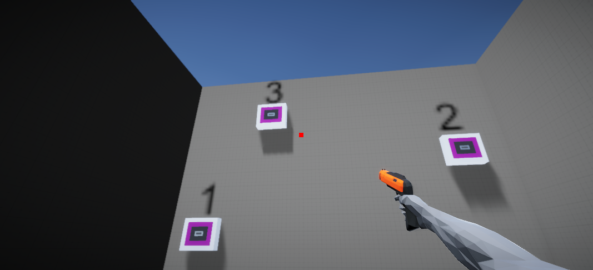
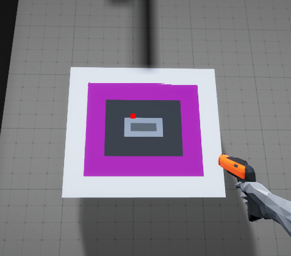
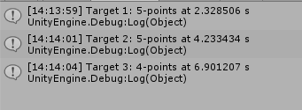

# Shooting-Range
The project was made for a 4th year course. The purpose of this project was to use Unity to find how differnt input devices (mouse, trackpad, controller) effect accuracy in a first-person shooter. This project uses ray casting to shoot bullets at the targets.

<b>Follow this path to open game:</b> Assets -> Let's Try Shooter -> Scenes -> Completed Scenes -> RayCastShootComplete

  
 
3-targets to shoot at

  
 
Close-up of target

  
 
Details of time and accuracy of shots

