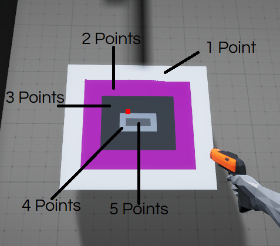

# Shooting-Range
<b>Follow this path to open game:</b> Assets -> Let's Try Shooter -> Scenes -> Completed Scenes -> RayCastShootComplete

  
 
3-targets to shoot at

  
 
Close-up of target

  
 
Details of time and accuracy of shots

